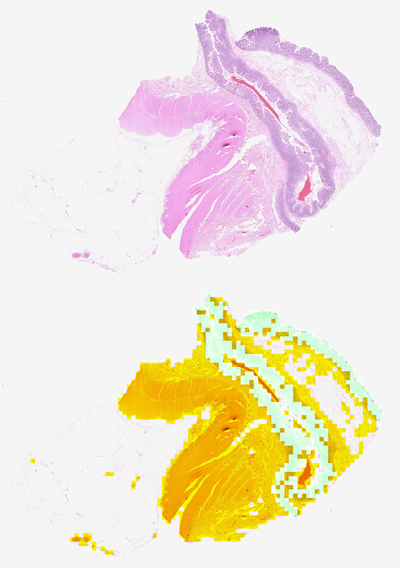
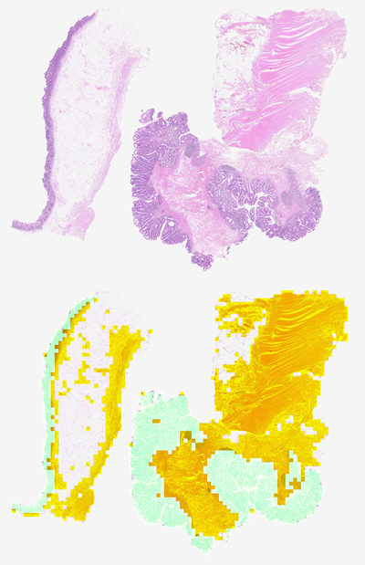
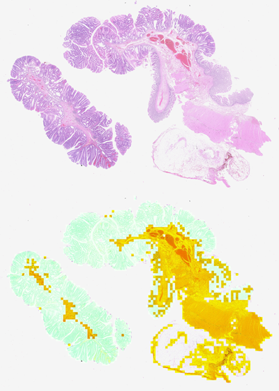

# Leveraging Machine Learning as a Mechanical Engineer 

<b>Check out my portfolio examples [here](https://github.com/brians1982/portfolio).</b>

I have been interested in the intersection of engineering simulation and physics-based machine learning for many years.  My background is in nonlinear structural finite element analysis, and machine learning was a natural step.  My first exposure to ML came around 2014, when I applied K-Means Clustering to group elements in a model by their stress-strain definition for continued simulation using another software package.  The initial simulation was a welding simulation with a moving heatsource.  The metallurgical phases in the heat affected zone and solidified region had property definitions based on heat exposure and cooling rates - every element in the HAZ and weld bead had a different stress-strain curve!  This level of detail was not feasible for continuation analysis in another FE package, so I used K-Means Clustering to group elements with similar stress-strain curves.

I created my first end-to-end FEA-surrogate model in early 2022, which entailed Abaqus scripting, Python routines to extract and organize data, surrogate model definition in TensorFlow, and an optimization wrapper in SciPy.  I had used many of these tools individually prior to this project.  Since then, I have explored PINNs and MeshGraphNets for different types of problems.  I have also explored 3d CNNs for flaw detection of CT-Scanned parts.

Since then, I have also created models using PyTorch, to be able to take advantage of the strengths of both TensorFlow and PyTorch.

I presented some of my work on FEA-Surrogate models at the Siemens Realize LIVE Conference, held in June, 2025 in Detroit, MI.  My colleague presented his work to automate CAD generation for training models and I discussed the training process and how I am using surrogates for rapid design space exploration.  Check out our presentation [here](Realize_Live2025_Shula_Stephens.pdf).

##

Outside of work, I am contributing to a couple research papers that combine digital pathology and machine learning. Check out our first preprint, [UltraLight Med-Vision Mamba for Classification of Neoplastic Progression in Tubular Adenomas](https://arxiv.org/abs/2508.09339) here.  I created the labeled tile dataset for this paper by training an EfficientNetV2S CNN to process hundreds of gigapixel digitized Whole Slide Images (WSIs) using training data from about 20 WSIs with regions of interest annotated by expert pathologists.  More of my work with CNNs and the GradCAM algorithm will be publicly available soon.

Example original WSIs and WSIs with an overlay of retained tiles (green shading) and discarded tiles (dark yellow shading).  Regions without shading do not pass an initial screening for the presence of tissue.

   

## 

# Portfolio

Check out my [portfolio](https://github.com/brians1982/portfolio) for several example machine learning and Python projects!  I have created examples for FEA-Surrogates, machine learning, FEA automation, and data processing in Python.

##

## Education

- MS in Mechanical Engineering, Univeristy of Notre Dame
- BS in Mechanical Engineering, University of Notre Dame
- For machine learning and data science courses on Coursera, see my [LinkedIn](https://www.linkedin.com/in/brianshula/) profile.

## Connect with me

- LinkedIn: [Brian Shula](https://www.linkedin.com/in/brianshula/)

<!--
**brians1982/brians1982** is a ✨ _special_ ✨ repository because its `README.md` (this file) appears on your GitHub profile.

Here are some ideas to get you started:

- 🔭 I’m currently working on ...
- 🌱 I’m currently learning ...
- 👯 I’m looking to collaborate on ...
- 🤔 I’m looking for help with ...
- 💬 Ask me about ...
- 📫 How to reach me: ...
- 😄 Pronouns: ...
- ⚡ Fun fact: ...
-->
